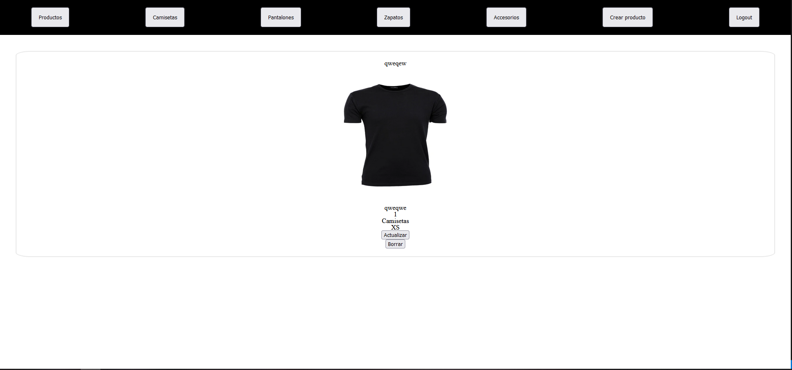

# Tienda de ropa

Estes proyecto es una tienda de ropa , en el pual se puede buscar productos por id , por categoria o todos, ademas si te logeas , puedes crear , editar o eliminar cualquiera de los productos creados.
## Tecnologías que he utilizado 🛠️

>Mi tienda esta creada en Mongo Atalas, Express,NodeJS,Swagger y FireBase
## Instalacion 
Primero debemos clonar este repositorio:
    git clone https://github.com/darkjg/backend-project-break
Segundo paso :
    Nos registramos en https://account.mongodb.com y creamos nuestra cuenta gratuita
Tercer paso :
    Creamos nuestro .env para guardar nuestros datos y conectamos nuestra aplicacion de mongo atlas con la variable de entorno MONGO_URI
Cuarto paso :
    Nos registramos en firebase y guardamos los datos de registro en nuestro archivo .env en las variables locales  APIKEY, AUTHDOMAIN, PROJECTID,STORAGEBUCKET,MESSAGINGSENDERID,APPID
Quito paso:
    En el terminal ponemos el comando npm i para que instale todos los paquetes
Sexto paso:
    npm start para iniciar la aplicacion 

## Rutas de web 

  ### Rutas usuario

  #### http://localhost:3000/products/
  
  #### http://localhost:3000/products/65db734f8948d4c32a39fcc4?
  

  #### http://localhost:3000/products/search/Camisetas?
  

  #### http://localhost:3000/products/search/Pantalones?
  
  
  #### http://localhost:3000/products/search/Zapatos?
  

  #### http://localhost:3000/products/search/Accesorios?
  

  ### Rutas cuenta

  #### http://localhost:3000/Register/?
  
  
  #### http://localhost:3000/login?
  

  ### Rutas de administrador

  #### http://localhost:3000/dashboard
  

  #### http://localhost:3000/products/65db734f8948d4c32a39fcc4?
  

  #### http://localhost:3000/dashboard/new?
  

  #### http://localhost:3000/dashboard/65db734f8948d4c32a39fcc4/edit?
  

## Rutas de api 

### Rutas de usuario
- GET /api/products: Devuelve todos los productos. Cada producto tendrá un enlace a su página de detalle.
- GET /api/products/:productId: Devuelve el detalle de un producto.
### Rutas de cuenta
- POST /register Permite registrar administradores
- POST /login Permite logearse como administrador
- POST /logout Permite desconectarte de la cuenta de administradores
### Rutas de administrador
- GET /api/dashboard: Devuelve el dashboard del administrador. En el dashboard aparecerán todos los artículos que se hayan subido.
- GET /api/dashboard/new: Devuelve el formulario para subir un artículo nuevo.
- POST /api/dashboard: Envia la  Creacion un nuevo producto.
- GET /api/dashboard/:productId: Devuelve el detalle de un producto en el dashboard.
- GET /api/dashboard/:productId/edit: Devuelve el formulario para editar un producto.
- POST /api/dashboard/:productId: Envia la  Actualizacion un producto.
- POST /api/dashboard/:productId/delete: Elimina un producto.
### Rutas de swager
- GET /api-docs/: Devuelve la documentacion de swagger

Hecho por [Jorge González Costa](https://github.com/darkjg/backend-project-break) 😊